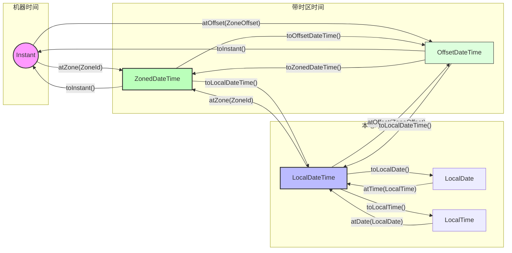

# 🧩 主题的核心逻辑

# 🔗 概念之间的关系

这些卡片解释了 "为什么" 和 "底层逻辑"

[[JSR-310 设计哲学 --- 不可变性与线程安全]]

[[机器时间 vs 人类时间]]

这些卡片是一些原子知识

[[Java Instant —— 时间轴上的绝对点]]

[[LocalXXX —— 本地时间的语境]]

[[ZonedDateTime vs OffsetDateTime —— 时区处理]]

[[Duration vs Period --- 时间量度的维度]]