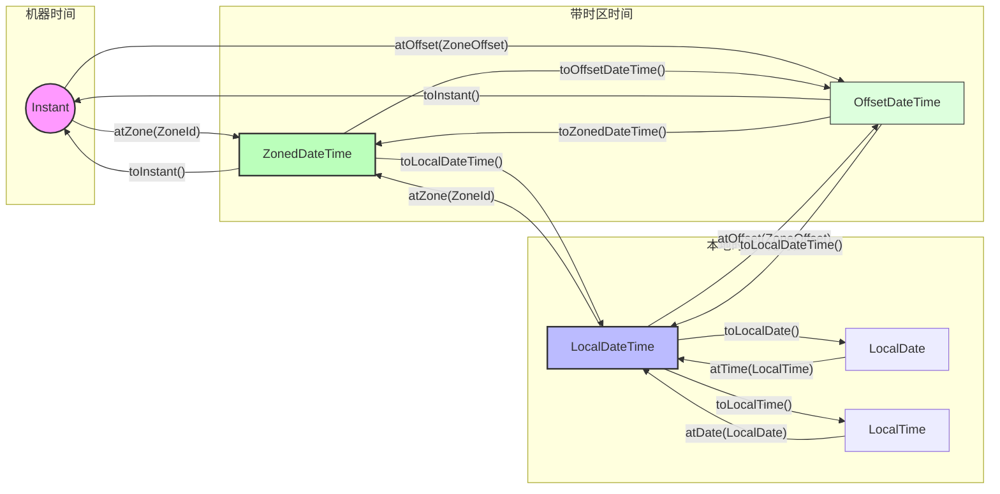

# 🌐 核心观点

`ZonedDateTime` 和 `OffsetDateTime` 是 Java 中用于处理时区的类, 在 `LocalDateTime` 的基础上, 分别存储了 `ZoneId` 和 `ZoneOffset`.

---

# 🔖 详细解释

## 1	偏移量 vs 时区

ZoneOffset (偏移量): 仅仅是一个数字, 表示**当前时间**与 **UTC**/格林威治时间的**差值**. 例如 +08:00. 它**不包含任何地理或历史规则**.

ZoneId (时区 ID): 是一个**地理区域**的标识, 如 `Asia/Shanghai` 或 `America/New_York`. 时区 ID 包含了偏移量, 但它不仅仅是偏移量. 它背后拥有一套完整的 "规则库"(TZDB), 记录了这个地区在历史上什么时候切换过时区, 以及什么时候实行**夏令时 (DST)**.

## 2	ZonedDateTime vs OffsetDateTime

- `OffsetDateTime` = `LocalDateTime` + `ZoneOffset`, 代表了一个绝对的时刻加上一个固定的偏移量, 是 "死板" 的. 它只知道此时此刻比 UTC 快或慢多久. 对机器极其友好的. 它在时间轴上的位置非常明确, 不随政策改变.
	
- `ZonedDateTime` = `LocalDateTime` + `ZoneId` (+ `ZoneOffset`), 代表了一个绝对的时刻加上一个具有地理属性的时区, 是“智能”的. 由于它持有 ZoneId, 它能自动感知夏令时切换. 对人类生活极其友好的.

假设在纽约(America/New_York), 夏令时切换的那一刻, 时钟会从 01:59 直接跳到 03:00, 如果用 ZonedDateTime 加 1 小时, 它会知道现在是 03:00. 如果用 OffsetDateTime, 它只会简单地根据数字加减, 可能导致逻辑上的混乱.

## 3	创建方法和常用 API

### 3.1	创建方式

```java
// 获取当前系统时区的时间
ZonedDateTime zdtNow = ZonedDateTime.now();
OffsetDateTime odtNow = OffsetDateTime.now();

// 指定具体时区/偏移量
ZonedDateTime zdt = ZonedDateTime.of(LocalDateTime.now(), ZoneId.of("Asia/Shanghai"));
OffsetDateTime odt = OffsetDateTime.of(LocalDateTime.now(), ZoneOffset.ofHours(8));

// 从 Instant 转化
ZonedDateTime zdtFromInstant = Instant.now().atZone(ZoneId.of("Europe/Paris"));
```

### 3.2	常用操作

**转换时区**(保持同一瞬间): `zdt.withZoneSameInstant(ZoneId. of("UTC"))`

**修改字段**: `odt.withHour(10).plusDays(1)`

**获取偏移量**: `zdt.getOffset()`, (注意: `ZonedDateTime` 的偏移量是根据日期自动计算出来的)

## 4	转换关系




---

# 📚 参考内容

