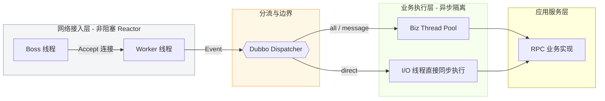

# 1	背景

Dubbo 线程模型是指框架内部处理网络 I/O 通信与具体业务逻辑执行的调度机制。核心目的是尽早释放网络线程，将耗时的业务逻辑派发到独立的业务线程池中执行，从而最大化的提升系统的并发处理能力和吞吐量，派发机制（Dispatcher）负责完成线程切换。

为了满足开发者在不同场景下的需求，Dispatcher 需要支持不同的派发策略。

# 2	核心设计

## 2.1	整体架构



`Dispatcher` 负责完成从 I/O 线程到业务线程的转接。`Dispatcher` 本身并不是最终执行者，它提供了一个 `dispatch()` 方法，用于创建 Dubbo Handler，在 `NettyServer` 或 `NettyClient` 初始化时，会调用 `Dispatcher.dispatch()` 方法创建 Handler，并将其放在消息处理的链路中。

## 2.2	接口定义

`Dispatcher` 接口定义如下，是一个 SPI 拓展点。

```java
// org.apache.dubbo.remoting.Dispatcher
@SPI(value = AllDispatcher.NAME, scope = ExtensionScope.FRAMEWORK)
public interface Dispatcher {

    @Adaptive({Constants.DISPATCHER_KEY, "dispather", "channel.handler"})
    ChannelHandler dispatch(ChannelHandler handler, URL url);
    
}
```

## 2.3	四种派发策略

Dubbo 提供了四种派发策略，每种派发策略对应 `Dispatcher` 接口的一个实现类：

| 策略名称      | 对应实现类                 | 行为描述                                         |
| :-------- | :-------------------- | :------------------------------------------- |
| all       | AllDispatcher         | 所有消息（请求、响应、连接事件、断开事件、心跳等）都派发到线程池执行。          |
| direct    | DirectDispatcher      | 所有消息直接在 IO 线程上执行，不派发到线程池。                    |
| message   | MessageOnlyDispatcher | 仅请求和响应消息派发到线程池；其他消息（连接、断开、心跳等）直接在 IO 线程执行。   |
| execution | ExecutionDispatcher   | 仅请求消息派发到线程池；其他消息（包括响应、连接、断开、心跳等）直接在 IO 线程执行。 |

# 3	源码关键实现

下面以 `AllDispatcher` 为例讲解 Dubbo 派发机制的原理。

```java
// org.apache.dubbo.remoting.transport.dispatcher.all.AllDispatcher#dispatch
@Override  
public ChannelHandler dispatch(ChannelHandler handler, URL url) {  
	return new AllChannelHandler(handler, url);  
}  
```

`AllDispatcher.dispatch()` 方法创建了一个 `AllChannelHandler`，其中 handler 由上层（Exchange 层）提供；在 `NettyClient` 和 `NettyServer` 初始化时都会调用这个方法，将 dispatcher. handler 添加到自己的调用链中。

```java
// org.apache.dubbo.remoting.transport.dispatcher.ChannelHandlers#wrapInternal
protected ChannelHandler wrapInternal(ChannelHandler handler, URL url) {  
    return new MultiMessageHandler(new HeartbeatHandler(ExtensionLoader.getExtensionLoader(Dispatcher.class)  
            .getAdaptiveExtension().dispatch(handler, url)));  
}
```
—— wrapInternal 方法，NettyClient 和 NettyServer 启动时均会调用该方法

```java
AllChannelHandler (org.apache.dubbo.remoting.transport.dispatcher.all)
	WrappedChannelHandler (org.apache.dubbo.remoting.transport.dispatcher)
		ChannelHandlerDelegate (org.apache.dubbo.remoting.transport)
			ChannelHandler (org.apache.dubbo.remoting)
```
—— AllChannelHandler 继承关系

实现 `ChannelHandlerDelegate` 接口表示该类对 ChannelHandler 的方法实现会委派给其内部包装的 handler，`ChannelHandlerDelegate` 有两个继承链路。
- `AbstractChannelHandlerDelegate` 的实现类负责在委托之前做一些额外处理，如封装心跳逻辑或对参数进行解码等，典型实现类为 `HeartbeatHandler`；
- `WrappedChannelHandler` 则负责消息派发机制的实现。

再来看 `wrapInternal()` 方法，它将传入的 handler 以如下方式包装，其中 `MultiMessageHandler` 和 `HeartbeatHandler` 均为上面提到的 `AbstractChannelHandlerDelegate` 的实现类，它们会在前置处理完自己的逻辑后，将消息交给 dispatcher handler 处理。

```java
MultiMessageHandler -> HeartbeatHandler -> dispatcher handler -> handler
```

